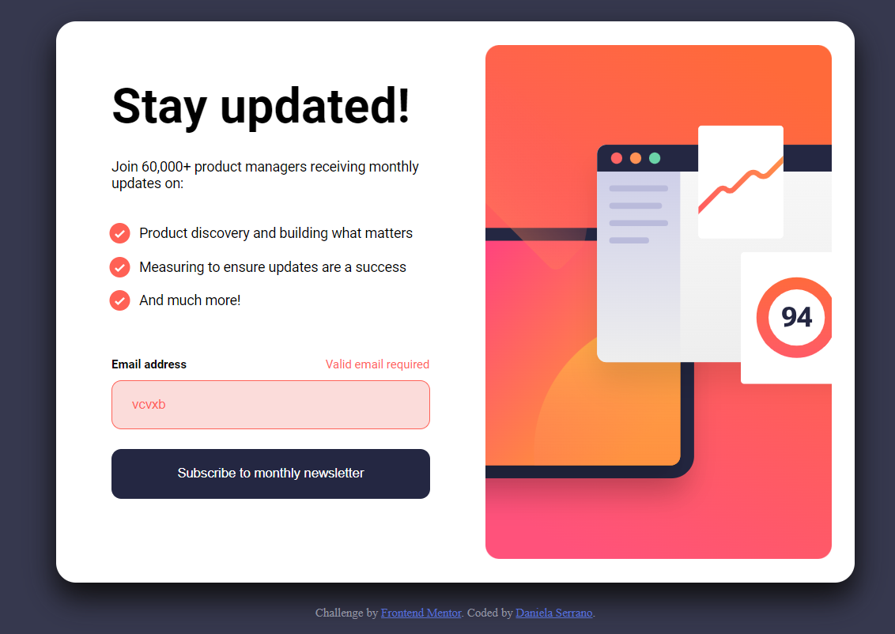

# Frontend Mentor - Newsletter sign-up form with success message solution

This is a solution to the [Newsletter sign-up form with success message challenge on Frontend Mentor](https://www.frontendmentor.io/challenges/newsletter-signup-form-with-success-message-3FC1AZbNrv). Frontend Mentor challenges help you improve your coding skills by building realistic projects. 

## Table of contents

- [Overview](#overview)
  - [The challenge](#the-challenge)
  - [Screenshot](#screenshot)
  - [Links](#links)
- [My process](#my-process)
  - [Built with](#built-with)
  - [What I learned](#what-i-learned)
  - [Continued development](#continued-development)
  - [Useful resources](#useful-resources)
- [Author](#author)
- [Acknowledgments](#acknowledgments)

## Overview

### The challenge

Users should be able to:

- Add their email and submit the form
- See a success message with their email after successfully submitting the form
- See form validation messages if:
  - The field is left empty
  - The email address is not formatted correctly
- View the optimal layout for the interface depending on their device's screen size
- See hover and focus states for all interactive elements on the page

### Screenshot



### Links

- Solution URL: [Github repository](https://github.com/danielaser/newsletter-sing-up)
- Live Site URL: [Web page](https://newsletter-sing-up.netlify.app/)

## My process

### Built with

- Semantic HTML5 markup
- CSS custom properties
- Flexbox
- Mobile-first workflow
- Vanilla JavaScript
- [Styled Components](https://styled-components.com/) - For styles

### What I learned

In this challenge I learned how to write a better HTML structure and to use functions with Vanilla JavaScript.
There are some examples below:

```html
<main class="container">
    <div class="card">
      <div class="card-content">
        <h1 class="card-title">Stay updated!</h1>
```

```js
function validateEmail(element) {
  //see complete function on the repository
}
```

### Continued development

Now, I am going to continue with other challenges to improve my JavaScript skills.

### Useful resources

- [CSS introduction](https://www.w3schools.com/css/css_boxmodel.asp) - This helped me to know more about CSS functionality. I really liked this pattern and will use it going forward.
- [CSS Flexbox](https://css-tricks.com/snippets/css/a-guide-to-flexbox/) - This is an amazing article which helped me finally understand flexbox. I'd recommend it to anyone still learning this concept.

## Author

- Website - [Daniela Serrano](https://danielaser.github.io)
- Frontend Mentor - [@danielaser](https://www.frontendmentor.io/profile/yourusername)

## Acknowledgments

As a junior developer I find a good documentation and examples that can help everyone who wants to build or add components to a project. There are many sides that can help us to find solutions and to use better programming practices [Useful resources](#useful-resources).
